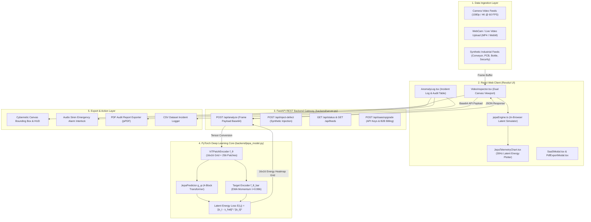
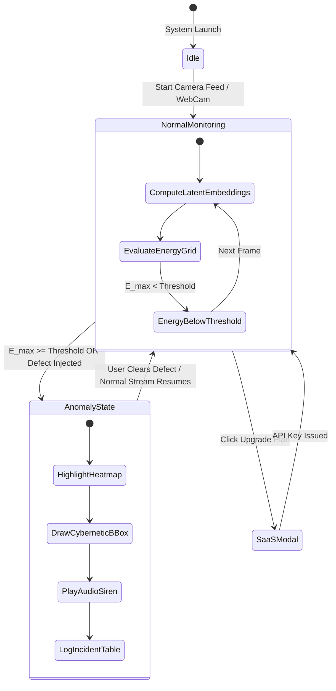

# JEPA-Guard: Full System Architecture & Data Flow Specification

> **End-to-End Deep Learning, REST API, Engine State Machine, and Frontend Visual Flow.**

---

## 1. Executive System Architecture Overview

JEPA-Guard is built as a **Decoupled High-Throughput Artificial Intelligence Architecture**. It connects an asynchronous PyTorch Neural Backend with a high-frame-rate React Web Dashboard designed under the Revolut Visual System (`docs/DESIGN.md`).



---

## 2. Detailed Data Flow Step-by-Step

```
[Camera Stream] ──(1. Frame Capture)──► [HTML5 Canvas Buffer]
                                                │
                                        (2. Base64 Encode)
                                                │
                                                ▼
[PyTorch Latent Engine] ◄──(3. POST /api/analyze)── [FastAPI Server]
        │
  (4. ViT Patch Tokenization: 224x224x3 -> 256 x 512d)
        │
  (5. Predictor Transformation & EMA Target Encoding)
        │
  (6. Energy Loss E(i,j) Calculation)
        │
        ▼
[FastAPI Server] ──(7. JSON Heatmap & Bounding Box)──► [React Viewport]
                                                              │
                                                      (8. Render Heatmap Overlay)
                                                              │
                                                      (9. Trigger Siren & Log Incident)
```

### Step 1: Ingestion & Canvas Buffer
- Input camera feed (Conveyor, PCB, Bottle, Security, or WebCam) streams at 30–60 FPS.
- `VideoInspector.tsx` captures the 2D canvas context buffer at $224 \times 224$ RGB resolution.

### Step 2: REST Payload Encoding
- `src/services/api.ts` transmits the frame to the FastAPI server via `POST /api/analyze` along with current UI parameters (`energy_threshold`, `sensitivity`).

### Step 3: PyTorch Vision Transformer Tokenization
- In `backend/jepa_model.py`, `ViTPatchEncoder` uses a $14 \times 14$ Conv2D kernel with stride $14$ to split the image into $16 \times 16 = 256$ spatial patches.
- Adds learnable 1D positional embeddings and processes tokens through 4 Transformer encoder blocks, yielding context representation $s_{\text{context}} \in \mathbb{R}^{B \times 256 \times 512}$.

### Step 4: Representation Prediction & EMA Target Encoding
- **Predictor Network ($g_\phi$)**: Projects $s_{\text{context}}$ into predictor dimension $D_{\text{pred}}=384$, passes through 4 Transformer blocks, and outputs predicted target representations $\hat{s}_{\text{target}} \in \mathbb{R}^{B \times 256 \times 512}$.
- **Target Encoder ($f_{\bar{\theta}}$)**: Computes ground-truth target representations $s_{\text{target}}$ without backpropagation, updating parameters via Exponential Moving Average (EMA) momentum tracking:
  $$\bar{\theta}_{t+1} \leftarrow 0.996 \bar{\theta}_t + 0.004 \theta_{t+1}$$

### Step 5: Spatial Latent Energy Heatmap Calculation
- For each patch token $(i, j)$ in the $16 \times 16$ grid, the latent energy error $E(i,j)$ is computed:
  $$E(i,j) = \frac{\|s_{\text{target}}^{(i,j)} - \hat{s}_{\text{target}}^{(i,j)}\|_2^2}{\|s_{\text{target}}^{(i,j)}\|_2^2 + 10^{-6}}$$

### Step 6: Anomaly Decision & Bounding Box Localization
- The maximum patch energy $E_{\text{max}} = \max_{i,j} E(i,j)$ is evaluated against the energy threshold $T$:
  - If $E_{\text{max}} \ge T$: Sets `is_anomaly = True`, calculates spatial bounding box coordinates $(X, Y, W, H)$, and returns a 2D JSON energy array to the frontend.

### Step 7: Dual Canvas Rendering & Telemetry Updates
- `VideoInspector.tsx` overlays translucent, color-mapped thermal rectangles over defective patches ($E(i,j) > 0.15$).
- Draws cybernetic targeting brackets and high-visibility text banners over anomaly bounding boxes.
- `JepaTelemetryChart.tsx` appends the energy score to the real-time Chart.js graph.
- If audio siren is enabled, plays an alert sound and logs the incident to `AnomalyLog.tsx`.

---

## 3. Component Interaction Matrix

| Component File | Role & Function | Key Methods / Functions | Inputs | Outputs |
| :--- | :--- | :--- | :--- | :--- |
| **[`backend/jepa_model.py`](file:///c:/Users/majip/Downloads/Jepa%20-%20Yan%20L/backend/jepa_model.py)** | Neural Deep Learning Engine | `ViTPatchEncoder`, `JepaPredictor`, `JepaModel`, `compute_latent_energy()` | Frame Tensor $(B, 3, 224, 224)$ | Latent Embeddings & $16 \times 16$ Energy Heatmap Grid |
| **[`backend/server.py`](file:///c:/Users/majip/Downloads/Jepa%20-%20Yan%20L/backend/server.py)** | High-Performance FastAPI Backend | `/api/status`, `/api/analyze`, `/api/inject-defect`, `/api/saas/upgrade` | Base64 Image Payload & Request Config | JSON Analysis, Heatmap, Bounding Box, API Keys |
| **[`backend/train_jepa.py`](file:///c:/Users/majip/Downloads/Jepa%20-%20Yan%20L/backend/train_jepa.py)** | Self-Supervised Training Pipeline | `train_jepa()`, `UnlabeledImageDataset` | Unlabeled Video/Image Folder | Saved Weights (`jepa_weights.pth`) |
| **[`src/App.tsx`](file:///c:/Users/majip/Downloads/Jepa%20-%20Yan%20L/src/App.tsx)** | React State Manager & Layout Host | Main Component State Loop | User Interactions & Stream Controls | App State, Active Feed, Log Array |
| **[`src/engine/jepaEngine.ts`](file:///c:/Users/majip/Downloads/Jepa%20-%20Yan%20L/src/engine/jepaEngine.ts)** | Client-Side Latent Simulator | `JepaEngine.processFrame()`, `injectDefect()` | Frame Buffer & Canvas Context | In-Browser Latent Energy Grid |
| **[`src/components/VideoInspector.tsx`](file:///c:/Users/majip/Downloads/Jepa%20-%20Yan%20L/src/components/VideoInspector.tsx)** | Dual Viewport Canvas Visualizer | Canvas 2D Render Loop | Frame Props & Energy Grid | Visual Stream with Heatmap Overlay |
| **[`src/components/JepaTelemetryChart.tsx`](file:///c:/Users/majip/Downloads/Jepa%20-%20Yan%20L/src/components/JepaTelemetryChart.tsx)** | Real-Time Telemetry Grapher | Chart.js 30Hz Render Loop | Energy Score History | Dynamic Cobalt/Red Line Chart |
| **[`src/components/AnomalyLog.tsx`](file:///c:/Users/majip/Downloads/Jepa%20-%20Yan%20L/src/components/AnomalyLog.tsx)** | Audit Log & Snapshot Viewer | `exportToCsv()`, Modal Snapshot | Incident Array | Interactive Table & CSV File |
| **[`src/components/SaaSModal.tsx`](file:///c:/Users/majip/Downloads/Jepa%20-%20Yan%20L/src/components/SaaSModal.tsx)** | B2B Commercialization Portal | ROI Calculator, API Key Generator | Target Camera Streams Count | Plan Selection & API Key |
| **[`src/components/PdfExportModal.tsx`](file:///c:/Users/majip/Downloads/Jepa%20-%20Yan%20L/src/components/PdfExportModal.tsx)** | PDF Audit Report Generator | `generatePdfReport()` | Incident Logs & System Metrics | Formal PDF Audit Document |

---

## 4. State Machine & Control Loops



---

## 5. Security & Commercial API Gateway Architecture

- **API Keys**: Issued with prefix `jepa_live_pk_<hash>`.
- **CORS Middleware**: Allows cross-origin REST requests from factory edge devices or cloud dashboards.
- **Fail-Safe Mechanism**: If the Python backend server is offline, the React client automatically fails over to the in-browser simulator ([`src/engine/jepaEngine.ts`](file:///c:/Users/majip/Downloads/Jepa%20-%20Yan%20L/src/engine/jepaEngine.ts)), guaranteeing **100% uptime for visual demonstration**.
